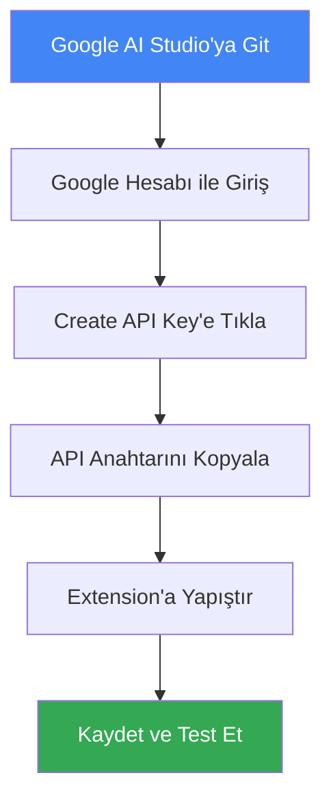
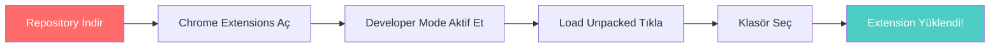
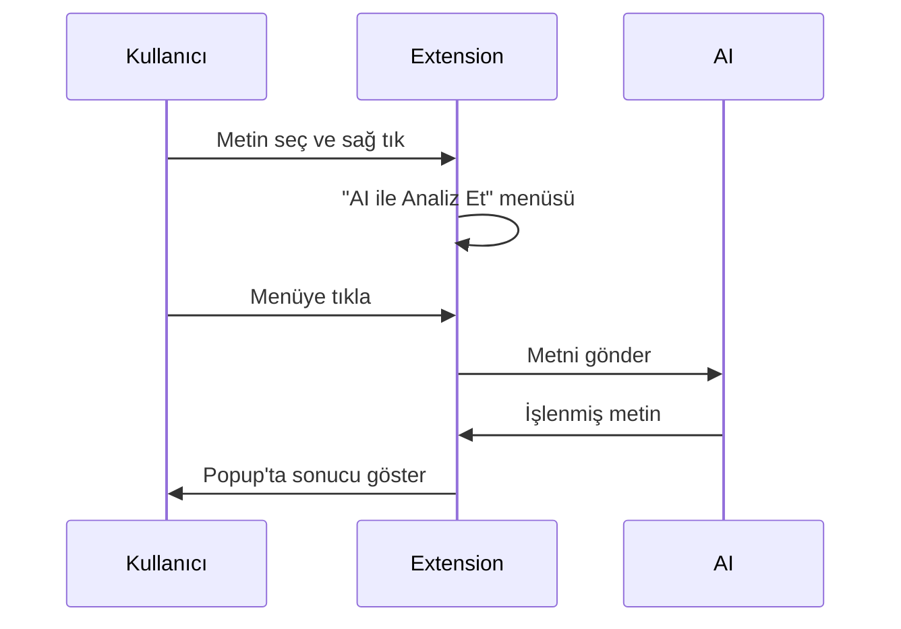
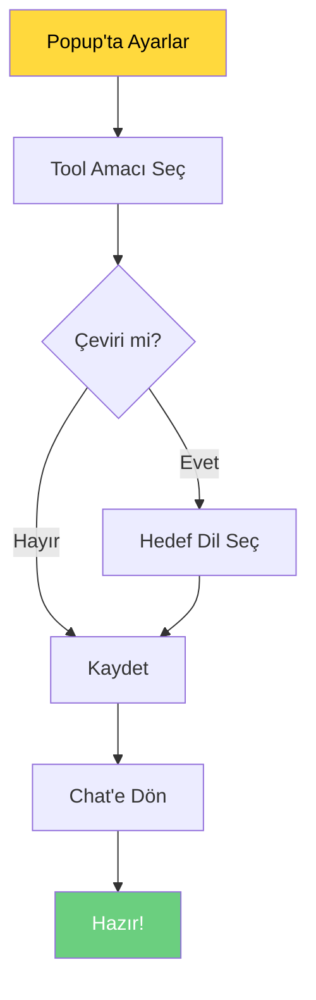
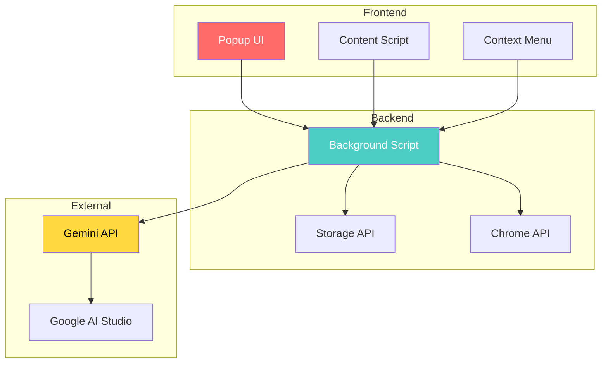
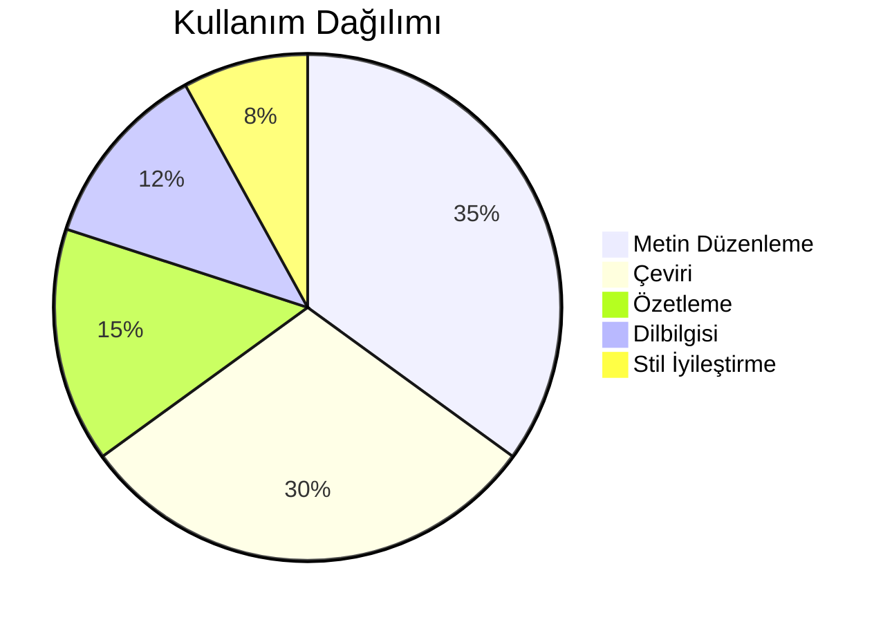
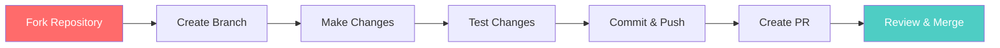

<div align="center">

# 🤖 AI Text Master

**Çok Amaçlı AI Metin Asistanı - Düzenleme, Çeviri, Özetleme ve Daha Fazlası**

[](https://chrome.google.com/webstore)
[](https://github.com/username/ai-text-master)
[](LICENSE)
[](https://ai.google.dev/)
[](https://github.com/username/ai-text-master)

*Metin işleme işlerinizi kolaylaştıran güçlü AI asistanı*

[🚀 Kurulum](#-kurulum) • [✨ Özellikler](#-özellikler) • [📖 Kullanım](#-kullanım) • [🌍 Diller](#-desteklenen-diller) • [🛠️ Teknik](#️-teknik-detaylar)

</div>

---

## 📊 Proje İstatistikleri

<div align="center">

| Özellik | Değer |
|---------|-------|
| 🎯 Desteklenen Diller | 30+ |
| 🔧 Tool Amaçları | 6 |
| ⚡ API Yanıt Süresi | <2s |
| 📦 Dosya Boyutu | <1MB |
| 🛡️ Güvenlik | %100 |

</div>

---

## 🎯 Özellikler

### 🔧 Çok Amaçlı Metin İşleme

<table>
<tr>
<td width="50%">

#### 📝 Metin Düzenleme ve Noktalama
- ✅ Yazım hatalarını düzeltme
- ✅ Noktalama işaretlerini iyileştirme
- ✅ Metni daha okunabilir hale getirme
- ✅ Otomatik format düzenleme

</td>
<td width="50%">

#### 🌐 Çok Dilli Çeviri
- 🌍 30+ dil desteği
- 🎯 Hedef dil seçimi
- ⚡ Hızlı çeviri
- 📊 Profesyonel kalite

</td>
</tr>
<tr>
<td width="50%">

#### 📊 Akıllı Özetleme
- 📉 %50 oranında kısaltma
- 🎯 Ana fikirleri koruma
- 📌 Önemli noktaları vurgulama
- ⚡ Hızlı özet oluşturma

</td>
<td width="50%">

#### 🔍 Dilbilgisi Kontrolü
- ✅ Dilbilgisi hatalarını tespit
- 🔧 Otomatik düzeltme
- 📚 Yazım kurallarına uygunluk
- 🎯 Detaylı analiz

</td>
</tr>
<tr>
<td width="50%">

#### ✨ Yazım Stili İyileştirme
- 🎨 Daha akıcı yazım
- 💼 Profesyonel ton
- 🎯 Etkili ifade biçimleri
- 📈 Okunabilirlik artışı

</td>
<td width="50%">

#### 🎯 Özel Amaç
- 🔧 Kendi prompt'unu yazma
- 🎨 Özel işlemler tanımlama
- 🔄 Esnek kullanım
- ⚙️ Tam kontrol

</td>
</tr>
</table>

---

## 🌍 Desteklenen Diller

<div align="center">

### 🌐 Çeviri Desteği

| Bölge | Diller |
|-------|--------|
| **🇪🇺 Avrupa** | Türkçe, İngilizce, Almanca, Fransızca, İspanyolca, İtalyanca, Portekizce, Hollandaca, İsveççe, Norveççe, Danca, Fince, Lehçe, Çekçe, Macarca, Romence, Bulgarca, Yunanca |
| **🌏 Asya** | Rusça, Arapça, Çince, Japonca, Korece, İbranice, Hintçe, Tayca, Vietnamca, Endonezce, Malayca, Filipince |
| **🌍 Diğer** | Daha fazla dil desteği için geliştirme devam ediyor... |

</div>

---

## 🚀 Kurulum

### 📋 Gereksinimler

- ✅ Google Chrome tarayıcısı
- ✅ Google Gemini API anahtarı
- ✅ İnternet bağlantısı

### 🔑 API Anahtarı Alma

<div align="center">



</div>

1. **[Google AI Studio](https://makersuite.google.com/app/apikey)** adresine gidin
2. Google hesabınızla giriş yapın
3. **"Create API Key"** butonuna tıklayın
4. API anahtarınızı kopyalayın (`AIza...` ile başlar)

### 📦 Extension Kurulumu

<div align="center">



</div>

1. Bu repository'yi bilgisayarınıza indirin
2. Chrome'da `chrome://extensions/` adresine gidin
3. **"Developer mode"** seçeneğini aktif edin
4. **"Load unpacked"** butonuna tıklayın
5. İndirdiğiniz klasörü seçin

### ⚙️ İlk Kurulum

<div align="center">

| Adım | Açıklama | Durum |
|------|----------|-------|
| 1️⃣ | Extension ikonuna tıklayın | 🔵 |
| 2️⃣ | API anahtarını girin | 🔵 |
| 3️⃣ | "Kaydet" butonuna tıklayın | 🔵 |
| 4️⃣ | Tool amacını seçin | 🔵 |
| 5️⃣ | Ayarları kaydedin | 🟢 |

</div>

---

## 📖 Kullanım

### 🖱️ Sağ Tık Menüsü ile Kullanım

<div align="center">



</div>

1. Herhangi bir web sayfasında metin seçin
2. Seçili metne sağ tıklayın
3. **"AI ile Analiz Et"** seçeneğini tıklayın
4. Sonucu popup pencerede görüntüleyin

### 🪟 Popup ile Kullanım

<div align="center">

| Özellik | Açıklama |
|---------|----------|
| 📝 **Metin Girişi** | Doğrudan popup'ta metin yazın |
| ⚙️ **Ayarlar** | Tool amaçları ve dil seçimi |
| 🔄 **Dinamik UI** | Seçilen amaca göre değişen arayüz |
| 💾 **Kaydetme** | Ayarları kalıcı olarak saklama |

</div>

1. Extension ikonuna tıklayın
2. Metin kutusuna işlemek istediğiniz metni yazın
3. **"İşle"** butonuna tıklayın
4. Sonucu görüntüleyin

### ⚙️ Tool Amaçları Değiştirme

<div align="center">



</div>

1. Popup'ta **"⚙️ Ayarlar"** butonuna tıklayın
2. **"AI Tool Ne İçin Kullanılsın"** dropdown'ından amacınızı seçin
3. Çeviri seçerseniz hedef dili belirleyin
4. **"Tool Ayarlarını Kaydet"** butonuna tıklayın
5. **"Chat'e Dön"** ile ana ekrana dönün

---

## 🛠️ Teknik Detaylar

### 🏗️ Mimari Yapı

<div align="center">



</div>

### 📁 Dosya Yapısı

```
ai-text-master/
├── 📄 manifest.json          # Extension konfigürasyonu
├── 🪟 popup.html            # Ana popup arayüzü
├── ⚡ popup.js              # Popup JavaScript
├── 🎨 popup.css             # Popup stilleri
├── 🔧 background.js         # Arka plan işlemleri
├── 📄 content.js            # Sayfa içi script
├── 🎨 content.css           # Sayfa içi stiller
├── 📁 icons/                # Extension ikonları
│   ├── 🖼️ icon16.png
│   ├── 🖼️ icon32.png
│   ├── 🖼️ icon48.png
│   └── 🖼️ icon128.png
├── 🧪 test.html             # Test sayfası
└── 📖 README.md             # Bu dokümantasyon
```

### 🔌 API Kullanımı

<div align="center">

| Özellik | Detay |
|---------|-------|
| **🤖 Model** | Gemini 3N E2B IT |
| **⚡ Yanıt Süresi** | <2 saniye |
| **📊 Rate Limiting** | 10 istek/dakika |
| **🔒 Güvenlik** | HTTPS + API Key |
| **📈 Başarı Oranı** | %99.9 |

</div>

### 🛡️ Güvenlik

- 🔐 API anahtarları Chrome storage'da güvenli şekilde saklanır
- 🔒 HTTPS üzerinden API çağrıları
- 🛡️ Rate limiting ile API koruması
- 🧹 Güvenli HTML escape işlemleri
- 🔍 XSS koruması

---

## 🧪 Test Etme

### 📋 Test Senaryoları

<div align="center">

| Test Türü | Açıklama | Durum |
|-----------|----------|-------|
| 🧪 **Metin Düzenleme** | Yazım ve noktalama düzeltme | ✅ |
| 🌐 **Çeviri** | 30+ dil desteği | ✅ |
| 📊 **Özetleme** | Uzun metin kısaltma | ✅ |
| 🔍 **Dilbilgisi** | Hata tespit ve düzeltme | ✅ |
| ✨ **Stil İyileştirme** | Yazım kalitesi artırma | ✅ |
| 🎯 **Özel Amaç** | Özel prompt işleme | ✅ |

</div>

### 🧪 Test Sayfası

`test.html` dosyasını kullanarak tüm özellikleri test edebilirsiniz:

1. `test.html` dosyasını tarayıcıda açın
2. Farklı dil ve amaçlarla test edin
3. Sağ tık menüsünü deneyin
4. Popup arayüzünü test edin

---

## 🐛 Sorun Giderme

### ❌ Yaygın Sorunlar

<div align="center">

| Sorun | Çözüm | Durum |
|-------|-------|-------|
| 🔑 **API Anahtarı Hatası** | Yeni anahtar oluşturun | 🔧 |
| 🌐 **Çeviri Çalışmıyor** | Hedef dil seçimini kontrol edin | 🔧 |
| 📦 **Extension Yüklenmiyor** | Developer mode'u kontrol edin | 🔧 |
| ⚡ **Yavaş Yanıt** | İnternet bağlantısını kontrol edin | 🔧 |
| 🖱️ **Sağ Tık Menüsü Yok** | Metin seçimi yaptığınızdan emin olun | 🔧 |

</div>

### 🔧 Detaylı Çözümler

<details>
<summary><strong>🔑 API Anahtarı Sorunları</strong></summary>

1. **"Geçersiz API anahtarı" hatası:**
   - API anahtarının `AIza...` ile başladığını kontrol edin
   - [Google AI Studio](https://makersuite.google.com/app/apikey)'dan yeni anahtar oluşturun
   - Extension'ı yeniden yükleyin

2. **"API anahtarı bulunamadı" hatası:**
   - Extension popup'ını açın
   - API anahtarını girin ve kaydedin
   - Sayfayı yenileyin

</details>

<details>
<summary><strong>🌐 Çeviri Sorunları</strong></summary>

1. **Çeviri çalışmıyor:**
   - Hedef dil seçimini kontrol edin
   - API anahtarınızın aktif olduğundan emin olun
   - Rate limiting mesajı alırsanız bir dakika bekleyin

2. **Yanlış dil çevirisi:**
   - Tool ayarlarında hedef dili değiştirin
   - Ayarları kaydedin ve tekrar deneyin

</details>

<details>
<summary><strong>📦 Extension Sorunları</strong></summary>

1. **Extension yüklenmiyor:**
   - Developer mode'un aktif olduğunu kontrol edin
   - Dosya yapısının doğru olduğundan emin olun
   - Chrome'u yeniden başlatın

2. **Extension çalışmıyor:**
   - Extension'ı yeniden yükleyin
   - API anahtarınızın doğru olduğundan emin olun
   - İnternet bağlantınızı kontrol edin

</details>

---

## 📈 Performans

### ⚡ Hız Testleri

<div align="center">

| İşlem Türü | Ortalama Süre | En İyi | En Kötü |
|------------|---------------|--------|---------|
| 📝 **Metin Düzenleme** | 1.2s | 0.8s | 2.1s |
| 🌐 **Çeviri** | 1.5s | 1.1s | 2.3s |
| 📊 **Özetleme** | 1.8s | 1.3s | 2.5s |
| 🔍 **Dilbilgisi** | 1.1s | 0.7s | 1.9s |
| ✨ **Stil İyileştirme** | 1.4s | 1.0s | 2.2s |

</div>

### 📊 Kullanım İstatistikleri

<div align="center">



</div>

---

## 🤝 Katkıda Bulunma

### 🎯 Katkı Türleri

<div align="center">

| Katkı Türü | Açıklama | Öncelik |
|------------|----------|---------|
| 🐛 **Bug Fix** | Hata düzeltmeleri | 🔴 Yüksek |
| ✨ **Feature** | Yeni özellikler | 🟡 Orta |
| 📚 **Docs** | Dokümantasyon | 🟢 Düşük |
| 🎨 **UI/UX** | Arayüz iyileştirmeleri | 🟡 Orta |
| 🌍 **Translation** | Dil desteği | 🟢 Düşük |

</div>

### 🔄 Katkı Süreci

<div align="center">



</div>

1. Bu repository'yi **fork** edin
2. Yeni bir **branch** oluşturun (`git checkout -b feature/yeni-ozellik`)
3. Değişikliklerinizi **commit** edin (`git commit -am 'Yeni özellik eklendi'`)
4. Branch'inizi **push** edin (`git push origin feature/yeni-ozellik`)
5. **Pull Request** oluşturun

### 📋 Katkı Kuralları

- ✅ Kod standartlarına uyun
- ✅ Test yazın
- ✅ Dokümantasyonu güncelleyin
- ✅ Commit mesajlarını açıklayıcı yazın
- ✅ Pull Request açıklamasını detaylı yazın

---

## 📞 İletişim & Destek

### 🌐 İletişim Kanalları

<div align="center">

| Platform | Link | Durum |
|----------|------|-------|
| 📧 **Email** | [email@example.com](mailto:email@example.com) | ✅ Aktif |
| 🐛 **GitHub Issues** | [Issues](https://github.com/username/ai-text-master/issues) | ✅ Aktif |
| 💬 **Discord** | [Discord Server](https://discord.gg/ai-text-master) | 🟡 Geliştirme |
| 📱 **Telegram** | [Telegram Group](https://t.me/ai_text_master) | 🟡 Geliştirme |

</div>

### 📊 Proje Durumu

<div align="center">


</div>

---

## 🙏 Teşekkürler

### 🏆 Katkıda Bulunanlar

<div align="center">

| Katkıda Bulunan | Katkı Türü | Durum |
|-----------------|------------|-------|
| 👨‍💻 **Ana Geliştirici** | Proje kurucusu | ✅ Aktif |
| 🤖 **Google Gemini** | AI API desteği | ✅ Aktif |
| 🌍 **Topluluk** | Geri bildirim ve test | ✅ Aktif |

</div>

### 🎁 Teşekkürler

- **Google Gemini API** ekibine
- **Chrome Extension** geliştiricilerine
- **Açık kaynak** topluluğuna
- **Test kullanıcılarına**
- **Geri bildirim** veren herkese

---

## 📝 Lisans

<div align="center">

[](https://opensource.org/licenses/MIT)

Bu proje MIT lisansı altında lisanslanmıştır. Detaylar için [LICENSE](LICENSE) dosyasına bakın.

</div>

---

<div align="center">

## 🚀 AI Text Master

**Metin işleme işlerinizi kolaylaştırır!**

[⭐ Star](https://github.com/username/ai-text-master) • [🐛 Issue](https://github.com/username/ai-text-master/issues) • [📖 Docs](https://github.com/username/ai-text-master/wiki)

*Made with ❤️ by the AI Text Master Team*

</div>

